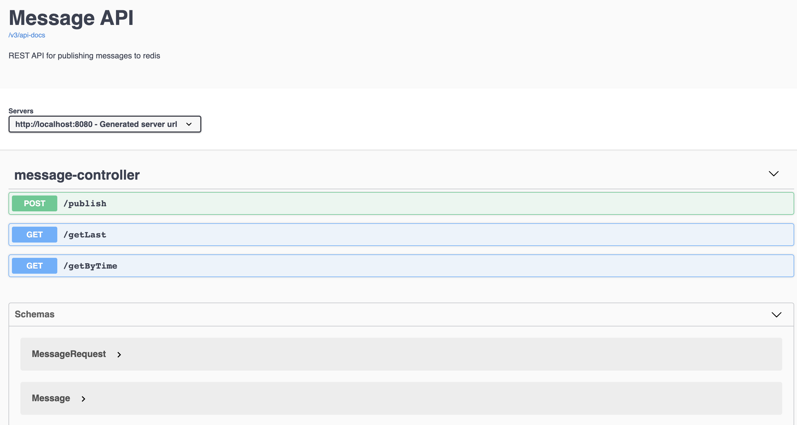

# Message Application
Simple application connecting to redis 

### Running the app
Navigate to the root of the project

`mvn clean install` 

`docker-compose up`

Show Swagger UI

`http://localhost:8080/swagger-ui.html`

